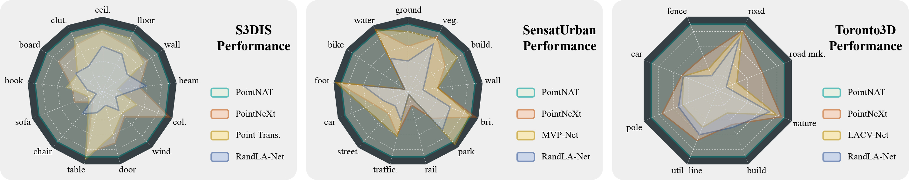

# PointNAT: Large Scale Point Cloud Semantic Segmentation via Neighbor Aggregation with Transformer

Here is the PyTorch implementation of the paper **_PointNAT: Large Scale Point Cloud Semantic Segmentation via Neighbor Aggregation with Transformer_**.

<div align='left'>

</div>

## Setup
- Install packages with a setup file
```
bash install.sh
```
- Dataset
```
mkdir -p data/S3DIS/
cd data/S3DIS
gdown https://drive.google.com/uc?id=1MX3ZCnwqyRztG1vFRiHkKTz68ZJeHS4Y
tar -xvf s3disfull.tar
cd ../../
```

## Train
```
CUDA_VISIBLE_DEVICES=0 bash script/main_segmentation.sh cfgs/s3dis/pointnat.yaml wandb.use_wandb=True
```
## Test
```
CUDA_VISIBLE_DEVICES='0' bash script/main_segmentation.sh cfgs/s3dis/pointnat.yaml wandb.use_wandb=False mode=test --pretrained_path path/to/pretrained/model.pth
```


## Acknowledgement
This repo is built upon OpenPoints.
```
https://github.com/guochengqian/openpoints
```
